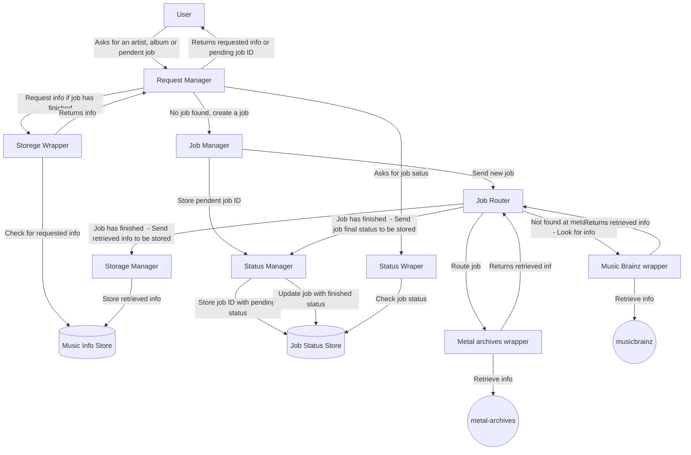

# Documentation about Music Collection Manager Project

[Actual Repo](https://git.windmaker.net/musicmanager/Music-Collection-Manager-Docs)

## Purpose

The aim of this project is to help me in order to manage my music collection.

Also, I want to split this project in different microsrvices in order to improve my knowledge about them and microsrvices architecture.

## Service Intercomunication

The following graph shows how microservices are communicated.

## Services

### Request Manager

[Repo](https://git.windmaker.net/musicmanager/Request-Manager)

Main entry of this Service, serves public API and communicates with other services.

Functions:
* Manage User requests
* Retrieve Required info.
* If required info was not found, a job with info retrieval request is requested to **Job Manager**.

### Job Manager

[Repo](https://git.windmaker.net/musicmanager/Job-Manager)

This service manages job traffic.

Functions:
* Creates jobs for retrieving artists and records info, which are received by **Job Router**.
* Creates jobs status.

### Job Router

[Repo](https://git.windmaker.net/musicmanager/Job-Router)

* Routes jobs to wrappers.
* If wrappers does not find required info, job is routed to the next configured wrapper.
* When there are no more wrappers to route jobs, this service sends info to **Storage Manager**.
* When there are no more wrappers to route jobs, this service send final job status to **Status Manager**.

### Metal Archives Wrapper

[Repo](https://git.windmaker.net/musicmanager/metal-archives-wrapper)

This service retrieves Artists and Records info from [Metal Archives](https://www.metal-archives.com/)

With or without info, state is returned to **Job Router**.

### Musicbrainz Wrapper

[Repo](https://git.windmaker.net/musicmanager/Musicbrainz-Wrapper)

This service retrieves Artists and Records from [MusicBrainz](https://musicbrainz.org/)

With or without info, state is returned to **Job Router**.

### Storage Manager

[Repo](https://git.windmaker.net/musicmanager/Storage-Manager)

This service stores and updates Artists, Albums and Jobs info.

### Storage Wrapper

[Repo](https://git.windmaker.net/musicmanager/storage-wrapper)

This service retrieves info from Music Info Storage.

### Status Manager

[Repo](https://git.windmaker.net/musicmanager/status-manager)

This service stores and updates jobs statuses.

### Status Wrapper

[Repo](https://git.windmaker.net/musicmanager/status-wrapper)

This service retireves jobs statuses.

## Common Libraries

Some microservices will use the same data types for their communications, instead of duplicating code, shared libraries will be used.

### Common types

[Repo](https://git.windmaker.net/musicmanager/Common-Types)

Common types used by Music Manager microservices ecosystem.
