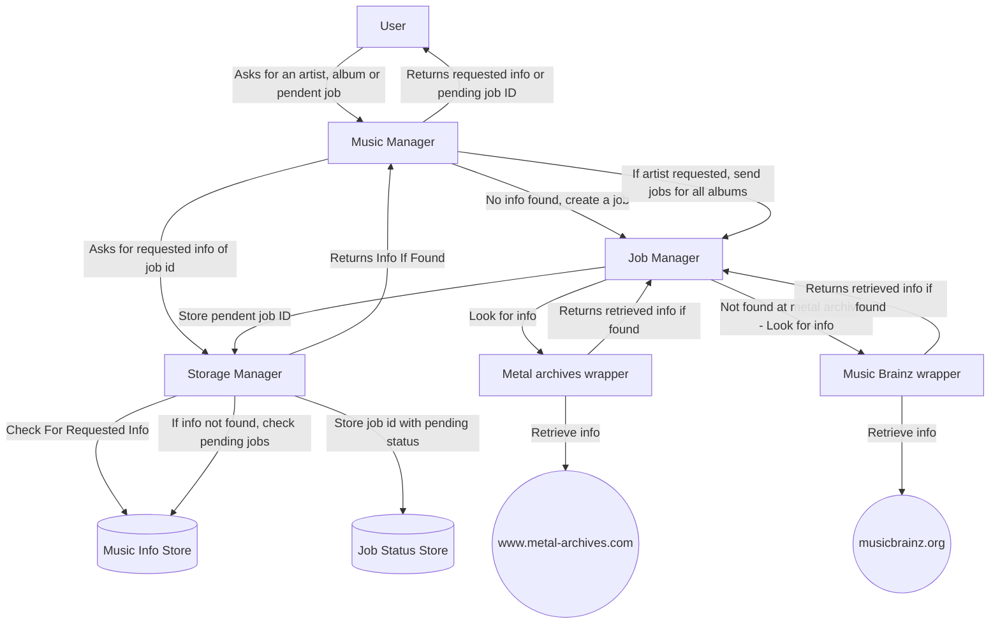

# Documentation about Music Collection Manager Project

## Purpose

The aim of this project is to help me in order to manage my music collection.

Also, I want to split this project in different microsrvices in order to improve my knowledge about microservices and Kubernetes. 

## Services

### Music Information Service

Repo

Main entry of this Service.

### Metal Archives Wrapper

[Repo](https://git.windmaker.net/musicmanager/metal-archives-wrapper)

This service retrieves Artitst and Records from [Metal Archives](https://www.metal-archives.com/)
If there is no info, this service publish a new job for Musicbrainz Wrapper.

### Musicbrainz Wrapper

Repo

This service retrieves Artitst and Records from [MusicBrainz](https://musicbrainz.org/)

## Service Intercomunication

The following graph shows how microservices are communicated.

